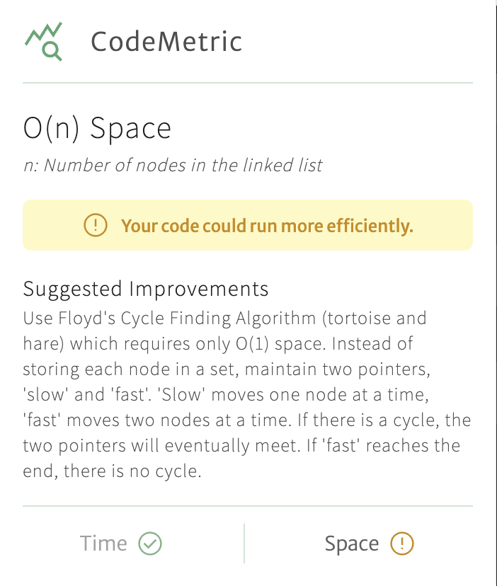

# 🧑‍💻 CodeMetric: LeetCode Complexity Insights, Powered by Gemini

CodeMetric is a Chrome extension powered by Google’s Gemini model to help you better understand and optimize your LeetCode submissions. It analyzes your code's time and space complexity and offers text-based suggestions for improvement, without changing or suggesting code.

Whether you're prepping for interviews or sharpening your algorithmic thinking, CodeMetric is your silent co-pilot for writing efficient solutions.

## 💬 Example Suggestion

CodeMetric automatically detects when your submission is not optimal. Here's an example using the LeetCode problem <a href="">141. Linked List Cycle</a>:

### Submitted Code

```python
class Solution:
    def hasCycle(self, head: Optional[ListNode]) -> bool:
        seen = set()
        current = head

        while current:
            if current in seen:
                return True

            seen.add(current)
            current = current.next

        return False
```

CodeMetric flags this solution as:

- Time Complexity: `O(n)`
- Space complexity: `O(n)` (due to the set)

The extension suggests improving the space complexity by using a two-pointer approach, reducing the space down to `O(1)`.



## 🛠️ Installation & Setup

Since CodeMetric uses Gemini via Google AI Studio, some setup is required before running the extension. Here's how to get it working:

### 1. Clone the Repository

```bash
git clone https://github.com/Karan-Manikani/CodeMetric.git
cd codemetric
```

### 2. Set Up Environment Variables

Create a `.env` file in the root directory and add your Gemini API key and the model you'd like to use. You can get these credentials from <a href="https://aistudio.google.com/">Google AI Studio</a>.

```env
VITE_MODEL_API_KEY=<your model key>
VITE_MODEL_NAME=<your model name>
```

Example:

```env
VITE_MODEL_API_KEY=AIzaSyD4R...
VITE_MODEL_NAME=gemini-2.0-flash
```

### 3. Build the extension

Install dependencies and build the project:

```bash
npm install
npm run build
```

This will compile the project and generate a /dist folder with the packaged Chrome extension.

### 4. Load the chrome extension

1. Open Chrome and go to `chrome://extensions/`
2. Enable Developer Mode (top-right toggle)
3. Click Load unpacked
4. Select the `/dist` folder from the project root

---

Done! 🎉 CodeMetric should now be active in your browser and integrated with your LeetCode workflow.
